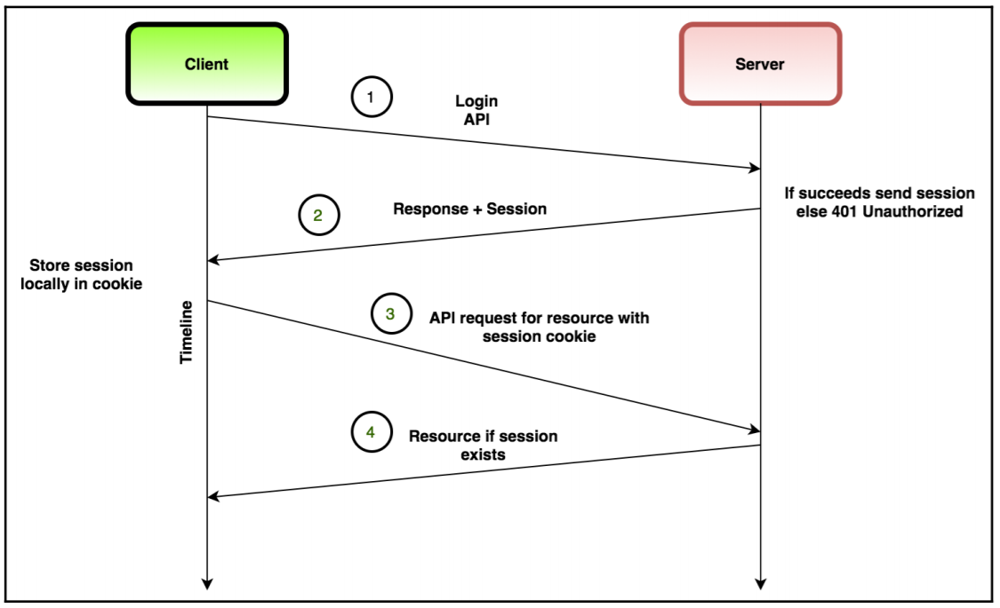

# What is Cookies?

- Cookies are small pieces of text sent to your browser by a website you visit. They help that website remember information about your visit, which can both make it easier to visit the site again and make the site more useful to you.

```
type Cookie struct {
    Name  string
    Value string
    Path       string    - indicates a URL path that must exist in req URL to send Cookie Header
    Domain     string    - specifies which hosts are allowed to recieve the cookie
    Expires    time.Time - deletes at specified date
    RawExpires string    // for reading cookies only
    // MaxAge=0 means no 'Max-Age' attribute specified.
    // MaxAge<0 means delete cookie now, equivalently 'Max-Age: 0'
    // MaxAge>0 means Max-Age attribute present and given in seconds
    MaxAge   int		- deletes cookie after specified amount of time in seconds
    Secure   bool		- sent to server on encrypted req, never unsecured (HTTP)
    HttpOnly bool		- not accessible by JavaScript, only sent to server
    SameSite SameSite 	- servers require that a cookie shouldn't be sent with cross-orign req
    Raw      string
    Unparsed []string   - raw text of unparsed attribute-value pairs
}
```

# What is UUID?

- A UUID stands for "Universally Unique Identifier". It's like a special code that is used to identify something or someone in a computer program or system. It's called "universally unique" because it's very, very unlikely that two things will have the same UUID. It's kind of like each thing or person gets their own special ID number that's different from everyone else's.

- Just like how each person has a unique name or ID number, computer programs and systems use UUIDs to keep track of things in a way that's organized and easy to manage. So, a UUID is a special code that helps computers keep track of different things in a really precise way.

# What is the difference between cookie and session?

Session and cookie are both ways to store data on the client side, but they serve different purposes and have different characteristics.

A cookie is a small piece of data that is stored on the client's browser. Cookies are typically used to store user preferences or login credentials, so that the user does not have to enter them every time they visit a website. Cookies can be persistent, meaning that they are stored on the client's browser even after the browser is closed, or they can be session-based, meaning that they are deleted when the user closes the browser. Cookies are sent to the server with every request, so they can be used to track user behavior or implement personalized content.

On the other hand, a session is a way to store data on the server side. When a user logs in to a website, the server creates a session and assigns a unique session ID to the user. This session ID is stored as a cookie on the client's browser, and is used to identify the user's session on subsequent requests. The session data itself is stored on the server, and can be used to store information about the user's state or preferences. Sessions are typically used to implement user authentication or to track user activity on a website.

The main differences between session and cookie are:

Data storage location: Cookies are stored on the client's browser, while session data is stored on the server.
Data persistence: Cookies can be persistent or session-based, while sessions are typically session-based and deleted when the user closes the browser.
Data security: Session data is more secure than cookies, since it is stored on the server and cannot be accessed or modified by the client. Cookies can be modified or stolen by malicious scripts or users.
Data size: Cookies have a maximum size limit of 4KB, while session data can be much larger.


